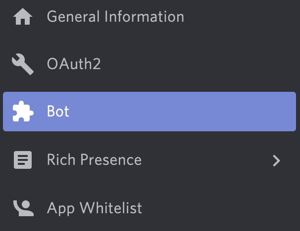

# Lancelot

The custom-made discord bot for the KnightHacks Discord server, powered by [scythe](https://github.com/KnightHacks/scythe)

As of 3/14/2023 this repository will no longer be maintained! 

<details>
<summary>Setting up your environment</summary>
<br>

## Preparing your environment

- Make sure you're running at least node v16.x

### Get the discord server template

Ask one of the devs in the discord for the Knight Hacks server template.

### Get a Token

You'll need a token in order to allow your bot to connect to Discord. Go to the
[Discord Developer Portal](https://discord.com/developers) to set up your
developer account. You will need to click "New Application" and follow the
prompts to set up your own test instance of Lancelot.

Once you've set up your test instance of the bot, you'll need to set up a test
bot user. Click "Bot" with the puzzle piece on the left side of the screen.



You should now be able to copy your token from the middle of the screen.
**Don't share this!** Anyone who has this token can control your bot account
and attach other bots to it or worse. Never publish it to source control
software like Git or GitHub.


Create a file called `.env` in the root of the project folder with the token.
This file should be automatically ignored by the Git configuration.

```bash
echo "DISCORD_TOKEN=YOUR_TOKEN_HERE" > .env
```

Next, you'll need to create your own testing server for the bot. Go to the plus
sign circle at the bottom of your servers and follow the prompts to create your
own server.


You will need to extract the **Guild ID** of the server you want to use for
testing. Go to the Discord settings and select "Advanced".


Turn the "Developer Settings" option on.


Go back to your servers and right click the testing server. You should now have
an option to "Copy ID", which will copy the guild ID to your clipboard.


Add the guild ID to the `.env` file:

```bash
echo "GUILD_ID=YOUR_GUILD_ID_HERE" >> .env
```

### Set up Permissions

Finally, you'll need to give your test bot the appropriate permissions so it
can do things. Head back to the [Discord Developer
Portal](https://discord.com/developers) and select your application. Then
select "Bot" in the sidebar.


Scroll down, and turn **on** the "Server Members Intent" and "Presence Intent"
options under "Privileged Gateway Intents".


Next, go to the OAuth2 page and **select "bot" and "application.command" under "Scopes"**. A bunch of
permissions should appear below; the following are recommended settings for the
bot permissions:


Discord will generate an link on the screen which you can use to add the bot to
a server. The simplest thing to do is to make your own testing server and then
follow the link, which will prompt you to add the bot to a server you
administer.

You should now be able to run `npm start` and start developing!
</details>

<details>
<summary>Available Scripts</summary>
<br>

## Available Scripts

In the project directory, you can run:

### `npm start`

An alias for `npm run start:dev`

### `npm run start:dev`

Starts and runs the development node server.

### `npm run start:prod`

Starts and runs the production node server.

### `npm test`

Starts and runs the unit test suite and shows results.

### `npm run build`

Compiles the source files.

### `npm run lint`

Lints all of the source files.
</details>
